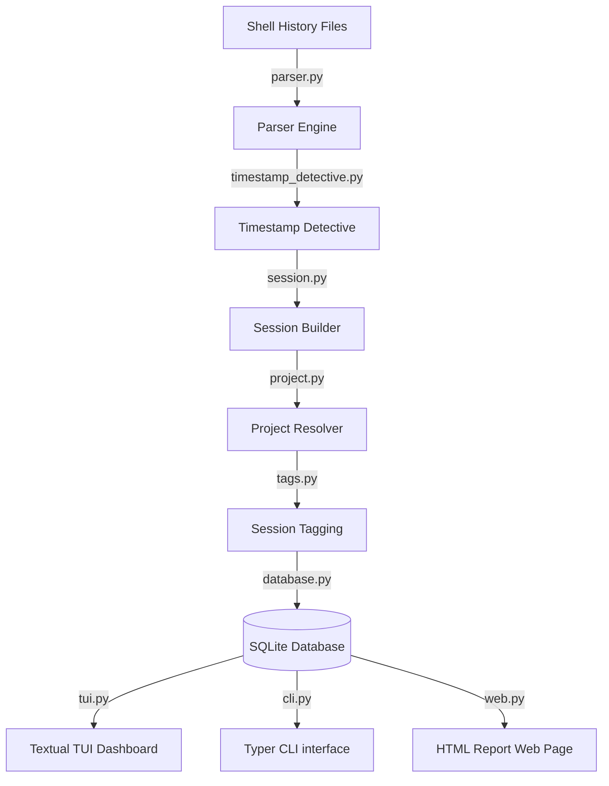
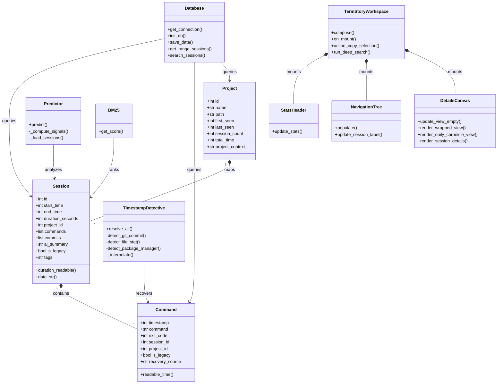

# TermStory Developer Memory Engine — State & Context (agents.md)

This file serves as the active development state, architectural roadmap, and design philosophy context for TermStory to ensure seamless pairing, verification, and handoffs.

---

## 1. Core Philosophy: Developer Memory Engine

TermStory is **not** a tracking tool, productivity auditor, or a generic manager dashboard. It is a **personal developer memory engine** designed to trigger recognition.
* **Recognize, don't inspect**: Optimize for recognition ("What did I work on?"). Details ("How do you know?") belong in `--detailed` mode.
* **Density over decoration**: Avoid rounded panels, double borders, or nested boxes. Use clean column alignment, simple tables, and minimal spacing. There is a strict ban on `rich.panel.Panel` in favor of dense text separators to maintain this philosophy.
* **Screenshot-friendly**: Every screen should fit in a single terminal screen/screenshot and tell a compelling story about a developer's day, search, or project.
* **Map General to Other**: "General / No Project" or empty project names are mapped to `"Other"`.
* **Noise Filtering**: Filter out routine navigation, status, and inspection commands (like `cd`, `ls`, `docker ps`, `git status`, `docker logs`, `grep`, etc.) so only creative/memorable work remains.

---

## 2. Technical Component Deep-Dive & Architecture

The codebase of TermStory is structured into logical sub-layers representing ingestion, database storage, analysis, formatting, terminal user interfaces, and optional AI features.

### Ingestion & Shell History Parsing
* **[parser.py](file:///Users/himanshuverma/personal/termstory/termstory/parser.py)**: Parses shell histories safely to extract Unix timestamps and clean command strings.
  * *Zsh Parser*: Parses extended format `: <timestamp>:<duration>;<command>`, switches to Hybrid Mode or Legacy Fallback when timestamps are missing. Filters out terminal multiplexer boundary sequences (`_zellij`, `tmux`, `prompt_command`, `kitty +kitten`) to avoid command corruption.
  * *Bash Parser*: Reads `.bash_history` using `#<timestamp>` rows or modifies timestamps backwards by 10s step intervals.
  * *Fish & PowerShell*: Discovers Fish blocks and PowerShell histories, reading timestamped commands.
* **[timestamp_detective.py](file:///Users/himanshuverma/personal/termstory/termstory/timestamp_detective.py)**: forensic engine recovering timestamps for un-timestamped legacy shell entries.
  * *Virtual CWD Tracker*: Tracks relative and absolute directories via shell navigation (`cd`, `pushd`, `popd`).
  * *Forensic Detectors*: Queries git commit logs (`git commit -m`), inline date strings, file system creation times (`touch`, `mkdir`), package manager installations (`brew`, `pip`, `npm`, `cargo`, `gem`), and Docker builds (`docker build`).
  * *Linear Interpolation*: Evenly spreads unresolvable commands between two recovered anchor timestamps.
* **[session.py](file:///Users/himanshuverma/personal/termstory/termstory/session.py)**: Chains chronological commands into sessions. Groups commands where user idle time is less than 30 minutes.
* **[project.py](file:///Users/himanshuverma/personal/termstory/termstory/project.py)**: Maps paths to logical project names via VCS roots (`.git`, `.hg`, `.svn`) or build descriptors (`pom.xml`, `package.json`, `Cargo.toml`). Implements NFS/SMB network loop protection using a `0.5s` daemon thread timeout.

### Database & Storage Layer
* **[database.py](file:///Users/himanshuverma/personal/termstory/termstory/database.py)**: Core storage layer. Enables WAL mode (`PRAGMA journal_mode = WAL;`) for concurrent execution, safe re-initialization if database corruption is detected, and SQLite FTS5 search index tables (`search_index`) for high-speed timeline matching.
* **[backup.py](file:///Users/himanshuverma/personal/termstory/termstory/backup.py)**: Backs up and restores the SQLite database.
* **[archive.py](file:///Users/himanshuverma/personal/termstory/termstory/archive.py)**: Archives older sessions, commands, commits, and summaries into a separate database file.

### AI Integration & RAG Search
* **[ai.py](file:///Users/himanshuverma/personal/termstory/termstory/ai.py)**: Zero-dependency Chat Completions wrapper utilizing `urllib.request`. Connects to Groq, OpenAI, or Ollama. Features LIFO worker cancellation, circuit breakers, socket timeouts, and thread safety.
* **[rag.py](file:///Users/himanshuverma/personal/termstory/termstory/rag.py)**: Combines TF-IDF/BM25 and local sentence embeddings (via optional `sentence-transformers` and `numpy`) for semantic hybrid search scoring.
* **[ask.py](file:///Users/himanshuverma/personal/termstory/termstory/ask.py)**: Prompts the LLM with matched RAG sessions to answer natural language questions about terminal history.

### User Interface & Formatting
* **[tui.py](file:///Users/himanshuverma/personal/termstory/termstory/tui.py)**: Textual TUI Dashboard. Implements non-blocking async workers (`@work(thread=True)`), double-buffering, clipboard integration (`pbcopy`, `xclip`, `wl-copy`, `clip`), matrix ingestion screens, and command playback ghost typing.
* **[formatter.py](file:///Users/himanshuverma/personal/termstory/termstory/formatter.py)**: Renders Rich tables, GitHub-style activity heatmaps, daily punch-card visual strips, focus score bars, Vampire Coder Indexes, RPG character sheets, and profiling timelines.
* **[timeline.py](file:///Users/himanshuverma/personal/termstory/termstory/timeline.py)**: ASCII visual activity bar charts.
* **[replay.py](file:///Users/himanshuverma/personal/termstory/termstory/replay.py)**: Interactive CLI terminal command playback playback.
* **[web.py](file:///Users/himanshuverma/personal/termstory/termstory/web.py)**: Renders statistics, heatmaps, and summaries to a responsive HTML report with customizable themes.

### Telemetry & Diagnostics
* **[insights.py](file:///Users/himanshuverma/personal/termstory/termstory/insights.py)**: Analytics engine parsing macro-telemetry (focus scores, Vampire index, Project Necromancer reactivation rates, and Rage-Quit signatures).
* **[stats.py](file:///Users/himanshuverma/personal/termstory/termstory/stats.py)**: Heatmap distributions, daily peak hours, and project language detection.
* **[tags.py](file:///Users/himanshuverma/personal/termstory/termstory/tags.py)**: Rule-based session categorization engine (`deploy`, `debug`, `setup`, `test`, `docs`).
* **[mcp_snapshot.py](file:///Users/himanshuverma/personal/termstory/termstory/mcp_snapshot.py)**: Model Context Protocol workspace snapshots (IDE name, git branch, modified files).
* **[reminder.py](file:///Users/himanshuverma/personal/termstory/termstory/reminder.py)**: JSON-based alert scheduling system.
* **[hermes_obs.py](file:///Users/himanshuverma/personal/termstory/termstory/hermes_obs.py)**: Nemo relay observability settings for Hermes.

---

## 3. Class Hierarchy

---

## 4. Test Structure & Verification

TermStory uses a comprehensive test suite in the **[tests/](file:///Users/himanshuverma/personal/termstory/tests)** directory to ensure concurrency safety, API reliability, TUI responsive resizing, and forensic accuracy.

### Core Test Categories
1. **Parser & Detective Forensic Logic**:
   * **[test_parser.py](file:///Users/himanshuverma/personal/termstory/tests/test_parser.py)**: Hybrid, Zsh, Bash, Fish, and PowerShell parsing tests. Asserts multiplexer reset commands are ignored.
   * **[test_timestamp_detective.py](file:///Users/himanshuverma/personal/termstory/tests/test_timestamp_detective.py)**: Unit tests for package managers (npm, gem, pip, cargo), inline dates, and linear interpolation.
   * **[test_quantum_leap.py](file:///Users/himanshuverma/personal/termstory/tests/test_quantum_leap.py)**: Robustness checks against temporal distortions.
   * **[test_macos_history_parser.py](file:///Users/himanshuverma/personal/termstory/tests/test_macos_history_parser.py)** & **[test_macos_quirks.py](file:///Users/himanshuverma/personal/termstory/tests/test_macos_quirks.py)**: Platform-specific path resolving and quote handling.
2. **Database Resilience & Concurrency**:
   * **[test_database.py](file:///Users/himanshuverma/personal/termstory/tests/test_database.py)** & **[test_database_queries.py](file:///Users/himanshuverma/personal/termstory/tests/test_database_queries.py)**: Index validations, migration assertions, and query caching.
   * **[test_fts5.py](file:///Users/himanshuverma/personal/termstory/tests/test_fts5.py)**: Full-Text Search indexing queries.
   * **[test_stress.py](file:///Users/himanshuverma/personal/termstory/tests/test_stress.py)** & **[test_expert_concurrency.py](file:///Users/himanshuverma/personal/termstory/tests/test_expert_concurrency.py)**: Heavy multi-threaded reads/writes mimicking massive concurrent database access.
   * **[test_corrupt_db.py](file:///Users/himanshuverma/personal/termstory/test_corrupt_db.py)**: Verifies the fallback rotation mechanism when encountering corrupt SQLite databases.
3. **AI Prompting & Client Diagnostics**:
   * **[test_ai.py](file:///Users/himanshuverma/personal/termstory/tests/test_ai.py)** & **[test_ai_error_surfacing.py](file:///Users/himanshuverma/personal/termstory/tests/test_ai_error_surfacing.py)**: Mocks chat completions endpoint. Validates escaping, timeout enforcement, command truncations, and circuit breakers.
   * **[test_rag.py](file:///Users/himanshuverma/personal/termstory/tests/test_rag.py)** & **[test_ask.py](file:///Users/himanshuverma/personal/termstory/tests/test_ask.py)**: Hybrid searches, tokenizers, BM25 TF-IDF scoring, and natural language prompt generation.
   * **[test_git_blame_anger_fortune_teller.py](file:///Users/himanshuverma/personal/termstory/tests/test_git_blame_anger_fortune_teller.py)**: Diagnostic validations for git translator and bug forecasting.
4. **TUI Layout & Resizing**:
   * **[test_tui.py](file:///Users/himanshuverma/personal/termstory/tests/test_tui.py)**: Textual app rendering, clipboard copying, and heatmaps.
   * **[test_expert_resize.py](file:///Users/himanshuverma/personal/termstory/tests/test_expert_resize.py)**: Layout responsive assertions.
   * **[test_expert_thread_starvation.py](file:///Users/himanshuverma/personal/termstory/tests/test_expert_thread_starvation.py)** & **[tests/stress/test_slowloris_tui.py](file:///Users/himanshuverma/personal/termstory/tests/stress/test_slowloris_tui.py)**: Simulates slow-responding network servers to verify that the UI worker queue debounces calls without locking TUI execution threads.

---

## 5. Main Data Flows

### Ingestion Lifecycle Flow
When commands are ingested (via `termstory ui`, `today`, or explicitly via `run_ingestion`):
1. **[cli.py:run_ingestion](file:///Users/himanshuverma/personal/termstory/termstory/cli.py#L77)** discovers history file paths using **[config.py:get_history_files](file:///Users/himanshuverma/personal/termstory/termstory/config.py#L31)**.
2. **[parser.py:parse_all_histories](file:///Users/himanshuverma/personal/termstory/termstory/parser.py#L396)** parses raw lines, sorting them chronologically.
3. If commands lack timestamps (Legacy mode), **[timestamp_detective.py:TimestampDetective](file:///Users/himanshuverma/personal/termstory/termstory/timestamp_detective.py#L76)** is instantiated to forensic-match and interpolate real timestamps.
4. **[session.py:create_sessions](file:///Users/himanshuverma/personal/termstory/termstory/session.py#L4)** groups the list of parsed commands into discrete session blocks.
5. **[project.py:detect_projects](file:///Users/himanshuverma/personal/termstory/termstory/project.py#L433)** resolves projects for each session based on VCS indicators, build configurations, and path sandwich heuristics.
6. **[tags.py:auto_tag_all_sessions](file:///Users/himanshuverma/personal/termstory/termstory/tags.py#L105)** tags each session (`deploy`, `debug`, `setup`, `test`, `docs`).
7. **[database.py:Database.save_data](file:///Users/himanshuverma/personal/termstory/termstory/database.py#L190)** records projects, sessions, commands, and git commits inside the SQLite database inside a safe database transaction.

### Q&A / Search Data Flow
1. User enters a query (via `termstory ask "<query>"` or TUI escape search).
2. **[ask.py:search_ask](file:///Users/himanshuverma/personal/termstory/termstory/ask.py#L114)** retrieves candidate sessions using FTS5 match queries on the database.
3. Sessions are scored and ranked via TF-IDF BM25 unigram/bigram matches.
4. If semantic hybrid search is enabled (via `search --semantic`), **[rag.py:hybrid_search](file:///Users/himanshuverma/personal/termstory/termstory/rag.py#L108)** generates embeddings, computes cosine similarities, and fuses BM25 and semantic scores.
5. Matches are formatted as a technical text prompt block in **[ask.py:generate_answer](file:///Users/himanshuverma/personal/termstory/termstory/ask.py#L254)**.
6. **[ai.py:_send_llm_request](file:///Users/himanshuverma/personal/termstory/termstory/ai.py#L20)** queries Groq/OpenAI/Ollama and outputs the result.

### Prediction Cadence Flow
1. User runs `termstory predict`.
2. **[predict.py:Predictor](file:///Users/himanshuverma/personal/termstory/termstory/predict.py#L76)** loads all non-legacy database sessions.
3. Heuristics compute scores:
   * *Recency*: Exponential decay weights based on session age.
   * *Time Affinity*: Matches the current hour block to historical session times.
   * *Day Cadence*: Matches the current weekday to project histories.
   * *Interruption Boost*: Detects if a session was suspended (>12h inactivity) and weights that project for resumption.
4. Top 3-5 workspace directories are printed via **[predict.py:format_predict_output](file:///Users/himanshuverma/personal/termstory/termstory/predict.py#L387)**, excluding noise commands.
